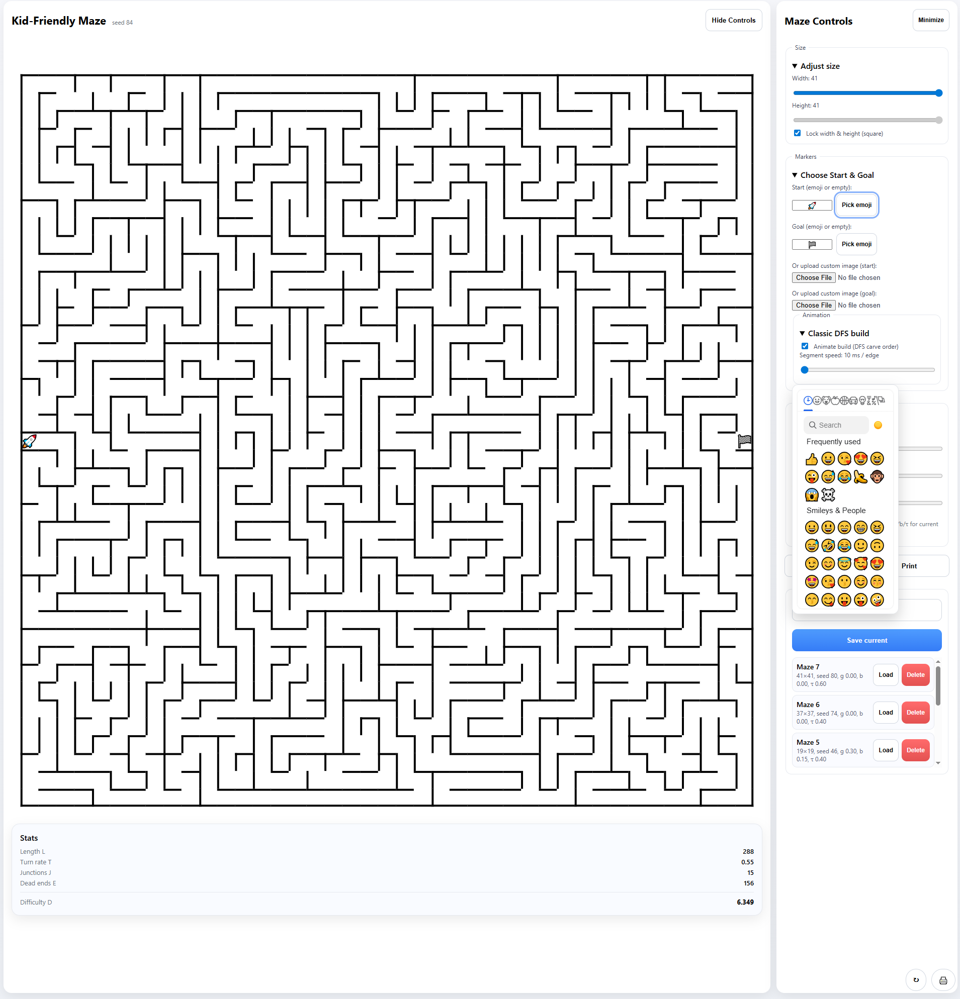
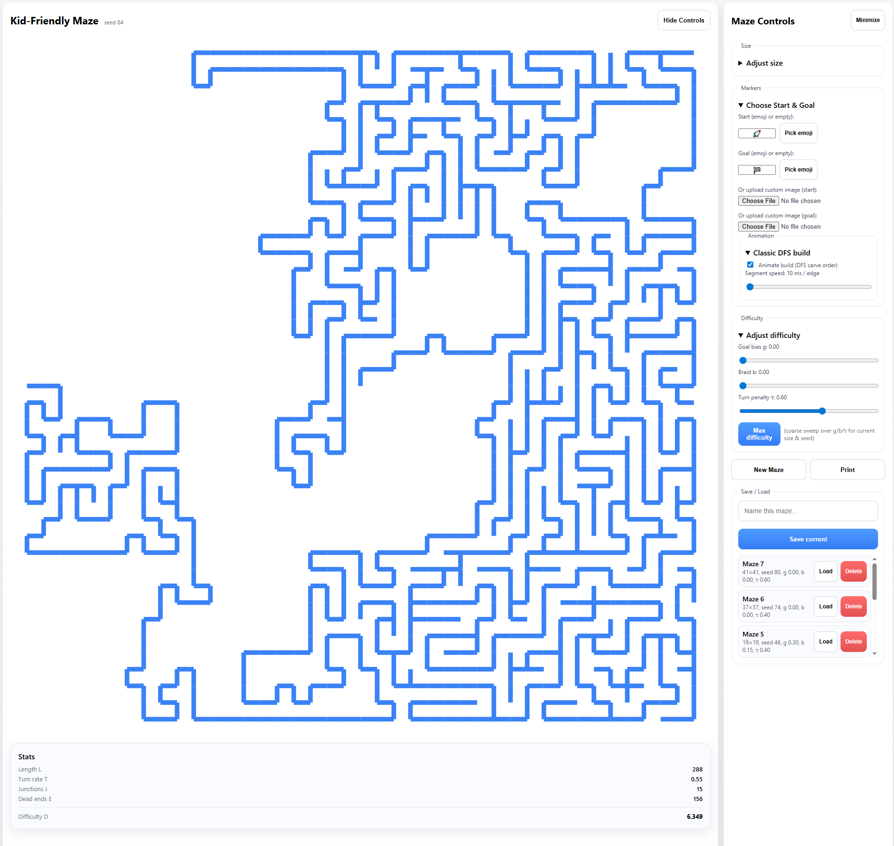
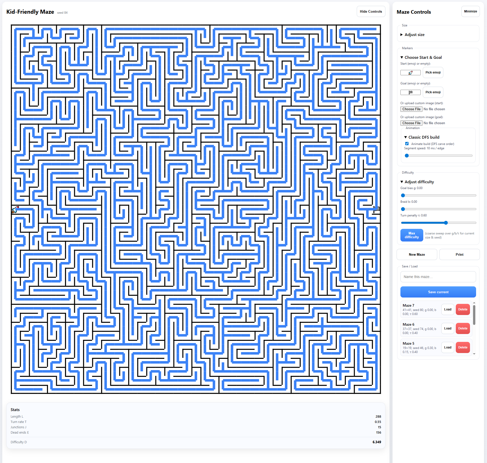

# 🌀 Infimaze

**Infimaze** is an offline-ready Progressive Web App (PWA) for generating and playing with endless, kid-friendly mazes.  
Built with **React + Vite + TypeScript**.


### Animations




---

## ✨ Features

- ✅ Random maze generator (adjustable width, height, difficulty)
- ✅ Offline support (PWA via `vite-plugin-pwa`)
- ✅ Save / load mazes locally
- ✅ Print only the maze (no UI clutter)
- ✅ Mobile-friendly controls with floating action buttons
- ✅ Start & Goal markers (emoji or image)
- ✅ Draw/erase path overlay with touch or mouse

---

## 📐 Maze Generation Algorithm

**Infimaze** uses a **graph-based recursive backtracker** algorithm with tunable parameters to control the *character* of the maze.

---

### 🔧 Core idea

1. **Grid setup**  
   The maze is an `H × W` grid of *cells*. Each cell starts with walls on all four sides.

2. **Depth-first search (DFS)**  
   Starting from the *start cell*, we:
   - Mark it visited.
   - Randomly choose a neighboring unvisited cell.
   - Knock down the wall between current and neighbor.
   - Recursively continue from that neighbor.
   - If stuck, backtrack.

   ➡ This guarantees a **perfect maze** (exactly one path between any two points).

3. **Parameters for *flavor***  
   To avoid every maze feeling the same, Infimaze introduces knobs:

   | Parameter | Meaning | Effect |
   |-----------|---------|--------|
   | **g** (goal bias) | Probability of preferring steps toward the goal | Higher `g` → straighter path, easier maze |
   | **b** (braid) | Chance to remove dead-ends after generation | Higher `b` → fewer cul-de-sacs, more loops |
   | **τ** (turn penalty) | Extra cost for sharp turns | Higher `τ` → longer corridors, fewer zig-zags |

   These are applied during neighbor selection and optional post-processing.

4. **Markers**  
   The top-left cell is the **start**; the bottom-right is the **goal**. Emoji or custom images can be placed here.

---

### ⚖️ Balancing act

- **Simplicity**  
  - Core DFS is under 50 lines of code.  
  - Easy to teach: good for tutorials and classrooms.  

- **Capabilities**  
  - Adding `g`, `b`, and `τ` exposes knobs for difficulty tuning.  
  - Small parameter sweeps let us find “max difficulty” settings for any grid size.  

- **Tutorial friendliness**  
  - The plain DFS version (no biases) is a classic “intro to algorithms” exercise.  
  - Then we show how to extend it with heuristics.  

- **Performance**  
  - O(N) in number of cells — even a 100×100 maze generates instantly in browser.  
  - Bias and braid tweaks add negligible overhead.  
  - Small enough to run interactively on mobile devices.  

---

### 🧭 Why this approach?

- ✅ **Deterministic** if you keep the random seed → makes mazes reproducible & savable.  
- ✅ **Scales** well for kids (small grids, low bias) or adults (big grids, braided).  
- ✅ **Extensible**: easy to add weights, alternative start/goal positions, or even non-rectangular grids.  
- ✅ **Teachable**: core algorithm is simple to visualize (stack of visited cells).  

---

## 🚀 Getting Started

### Development
```bash
npm install
npm run dev
```

# Regressions a corrections
- Fixed: New maze button was not working (App.tsx)
- Added: Basic test for maze stats (stats.spec.ts)
- Added: TypeScript types for better type safety (App.tsx)
- Added: .gitignore entries for common unwanted files (e.g., .env, .vscode) (.gitignore)
- Added: TypeScript configuration improvements (tsconfig.json)
- Added: Debugging console logs in MazeView component (MazeView.tsx)
- Added: Jest and Node types to tsconfig for testing support (tsconfig.json)
- Added: Path aliasing in tsconfig for cleaner imports (tsconfig.json)
- Added: Included tests directory in tsconfig for type checking (tsconfig.json)
- Fixed: Ensured consistent casing in file names (tsconfig.json)
- Fixed: Ensured maze stats test checks for expected structure and values (stats.spec.ts)
- Fixed: Ensured maze generation stats test uses correct expected value (stats.spec.ts)
- Working image imports for start/goal markers (App.tsx)
- Fixed: stats calculation error in maze generation (maze.ts)
- Fixed: useEffect dependencies to avoid unnecessary re-renders (MazeView.tsx)
- working save/load maze state (App.tsx) 
- working difificulty settings (App.tsx)
- working animations control (App.tsx, MazeView.tsx)
