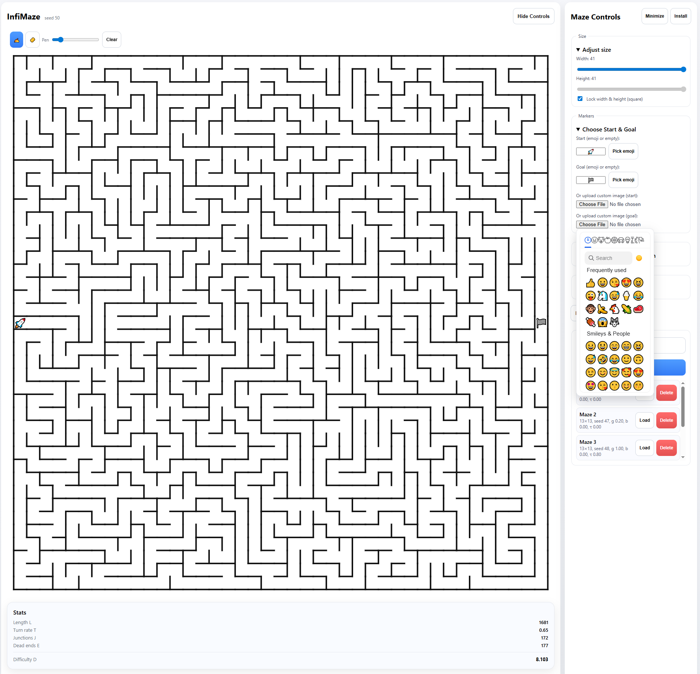
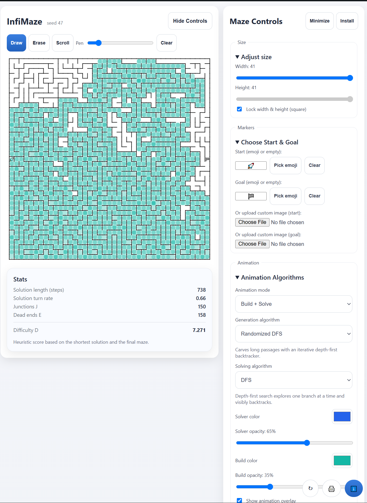
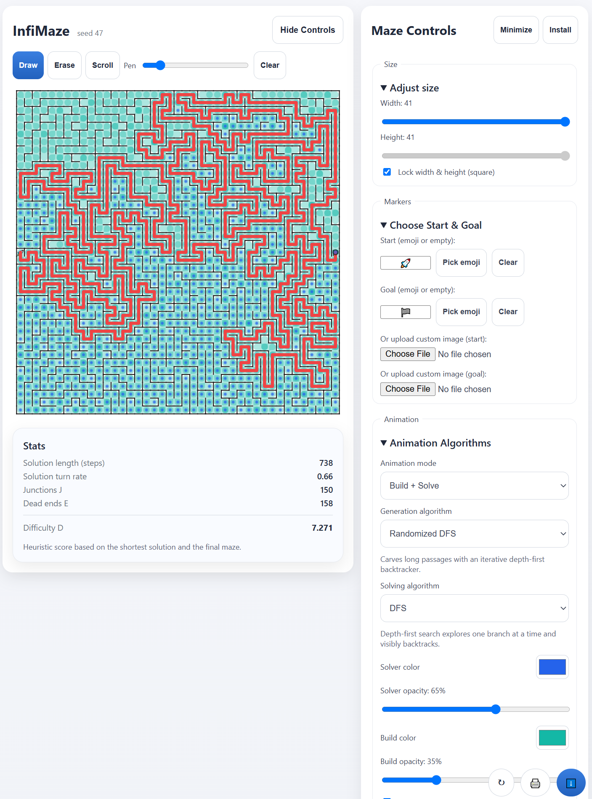

# InfiMaze

InfiMaze is a React, TypeScript, and Vite PWA for generating, drawing on, saving,
sharing, and printing mazes.



NEW SOLVER + BUILDER ANIMATIONS!




## Run locally

Use Node.js 24 (also used by CI).

```sh
npm ci
npm run dev
```

On Windows, use `npm.cmd` and `npx.cmd` if PowerShell blocks the corresponding
`.ps1` shims.

## Features and behavior

- Generate deterministic mazes with odd widths/heights from 7 to 41 cells.
- Select rectangular, elliptical, diamond, heart, star, cup, brain, or moose-shaped maze masks. Import PNG, JPEG, or WebP silhouettes and tune their threshold or inversion with a live preview. Generation,
  solving, animation, saving, and sharing all respect the selected shape.
- Adjust goal bias, braiding, and straight-direction preference. Square lock
  synchronizes dimensions; loading a rectangular saved maze releases the lock.
- Start and goal sit at opposite ends of the middle row.
- Use emoji, short text, or uploaded PNG/JPEG/GIF/WebP markers. Uploads must be
  no larger than 5 MB and are converted to PNG at a maximum of 256 pixels per side.
  Animated uploads become a still image. Clearing a marker restores its colored dot.
- Draw, erase, and clear a freehand path. Drawing stays aligned when the viewport
  changes and clears when the maze changes. Select **Scroll** to scroll by touch
  over the maze. Drawing is session-only and is not a validated solution.
- Save/load/delete mazes in browser storage, including their parameters and markers.
  Settings also persist. Storage failures are shown instead of reporting a
  successful save. Clearing browser data removes local saves.
- Share links preserve generation parameters and text/emoji markers, including
  compound emojis and empty markers. Uploaded images and drawings stay local;
  image markers become colored dots in shared links. Legacy links remain supported.
- Open **Animation Algorithms** to replay construction, solving, or both as one
  timeline. Choose randomized DFS, Prim, or Kruskal generation independently from
  DFS, breadth-first search, Dijkstra, or A* solving. One playback system provides
  pause/play, restart, single-step, progress seeking, speed control, phase colors,
  construction and solver color/opacity pickers, final routes, and comparable solver metrics. Randomized DFS generation and DFS
  solving remain the defaults. A new maze or algorithm selection restarts playback;
  reduced-motion preferences suppress the visual overlay.
- Print the blank maze without controls, animation, or drawing overlays.
- After the production service worker is ready, the app, emoji picker, and
  difficulty search work offline. Install when the browser offers installation.
  Updates require clicking **Update** and clear the current drawing.

## Generation and difficulty

The generator uses an iterative depth-first backtracker and a seeded random source.
The initial spanning tree is a perfect maze: each pair of cells has one route.
Optional braiding removes additional interior walls, creating loops.

The existing random sequence is preserved so older saved/shared parameters retain
their original layouts. Changing the selection algorithm in the future requires a
versioned format or migration, not simply changing the current seed contract.

| Parameter | Behavior |
| --- | --- |
| `g` (0–1) | Extra directional weight toward the goal |
| `b` (0–0.5 in the UI) | Probability of attempting an extra opening at a dead end |
| `tau` (0–1) | Extra weight for continuing straight |

The displayed statistics are calculated on the **final braided maze**:

| Statistic | Definition |
| --- | --- |
| `L` | Shortest start-to-goal route length, in cell-to-cell steps |
| `T` | Direction changes along that route divided by `L - 1`; zero for fewer than two steps |
| `J` | Number of cells with at least three open neighbors |
| `E` | Number of cells with exactly one open neighbor |
| `D` | Heuristic score: `0.7 log2(L + 1) + 0.8 T + 0.5 J/N + 0.3 E/N`, where `N` is cell count |

Scores are rounded to three decimals and are not calibrated against human solving
difficulty. A zero-length solution has score zero. If several shortest routes
exist, the deterministic breadth-first traversal selects one for the turn rate.

**Max difficulty** searches 216 combinations of g/b/tau plus the current settings,
retains the seed and dimensions, and never selects a lower-scoring result. It runs
in a worker; changing maze parameters cancels a pending search. It is a coarse
search, not a guarantee of the globally hardest maze.

## Verification

```sh
npm test -- --runInBand
npm run typecheck
npm run build
npx playwright install chromium
npm run test:e2e
```

The build runs TypeScript checking, including application, tests, and configuration.
Browser tests run against a production preview on port 4173. Windows tests use the
installed Microsoft Edge browser; Linux/macOS use Playwright Chromium. On CI,
`npx playwright install --with-deps chromium` installs the browser and OS packages.

Regression coverage includes seed compatibility, connectivity/walls, solution
statistics, all four solver paths, marker injection, malformed/legacy links, persistence, animation,
drawing, uploads, picker layout/focus, printing, manifest assets, and offline reload.
Desktop and mobile emulation are covered. Physical iOS/Android installation and
actual printer dialogs still need device checks when preparing a release.

## GitHub Pages / subpath hosting

Set `VITE_BASE` to the project path, including both slashes. The Vite PWA
configuration generates the single manifest and service worker.

```sh
VITE_BASE=/maze-pwa/ npm run build
VITE_BASE=/maze-pwa/ TEST_BASE=/maze-pwa/ npm run test:e2e
```

PowerShell equivalent:

```powershell
$env:VITE_BASE = '/maze-pwa/'
$env:TEST_BASE = '/maze-pwa/'
npm.cmd run build
npm.cmd run test:e2e
Remove-Item Env:VITE_BASE, Env:TEST_BASE
```

The workflow checks pull requests to main and validates main builds before
publishing to GitHub Pages. No deployment occurs for pull requests.

The completed stabilization checklist and verification evidence are recorded in
[IMPLEMENTATION_PLAN.md](IMPLEMENTATION_PLAN.md). The solver playback architecture
and verification are recorded in [SOLVER_PLAYBACK_PLAN.md](SOLVER_PLAYBACK_PLAN.md).
Hints, route validation, win detection, Micromouse simulation, shaped maze
generation, and drawing persistence remain optional future features.
The unified animation replays maze construction first and then continues into
solver exploration using separate colors, independent algorithm selectors, and
shared playback controls.
