# InfiMaze user manual

InfiMaze creates deterministic printable mazes, playable puzzles, algorithm visualizations, and offline Micromouse experiments. The maze stays on a white surface for legible play and printing; application controls support light, dark, system, high-contrast, and color-blind-safe presentation.

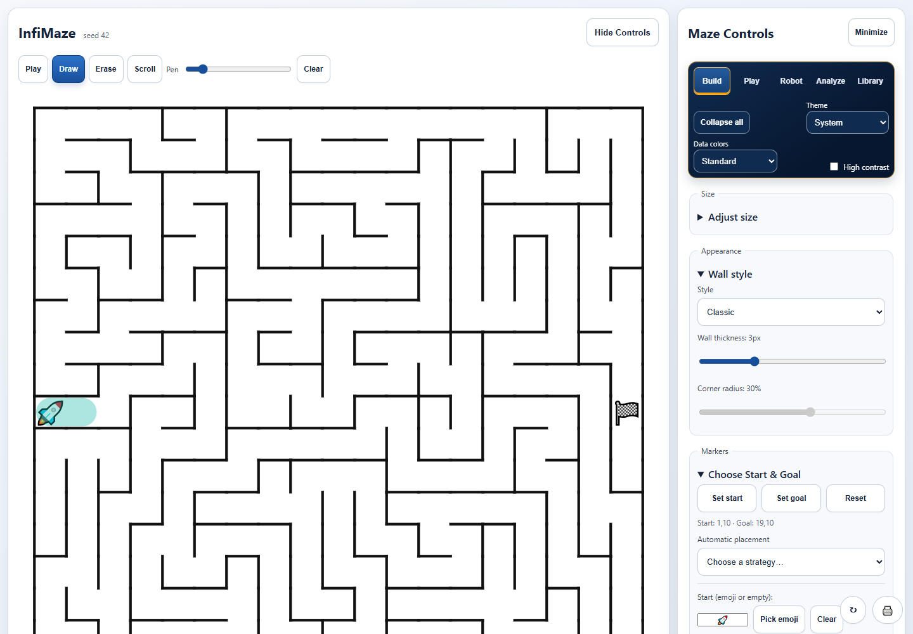

## Getting oriented

The maze occupies the main panel. **Maze Controls** are organized into five pages:

| Page | Purpose | Use it when |
| --- | --- | --- |
| **Build** | Define the maze and its appearance | Creating a puzzle, shape, endpoint layout, or printable design |
| **Play** | Play, review attempts, rank results, and connect competition rooms | Solving or comparing human results |
| **Robot** | Configure and run Micromouse experiments | Studying partial-knowledge robotic navigation |
| **Analyze** | Animate and compare algorithms or search for difficult mazes | Teaching, inspecting, and benchmarking algorithms |
| **Library** | Save, organize, print, export, and restore data | Managing a reusable maze collection |

Use **Collapse all** to shorten the active page. **Minimize** hides the control panel. On the maze toolbar, choose **Play**, **Draw**, **Erase**, or **Scroll** so touch gestures have an unambiguous purpose.

## Build a maze

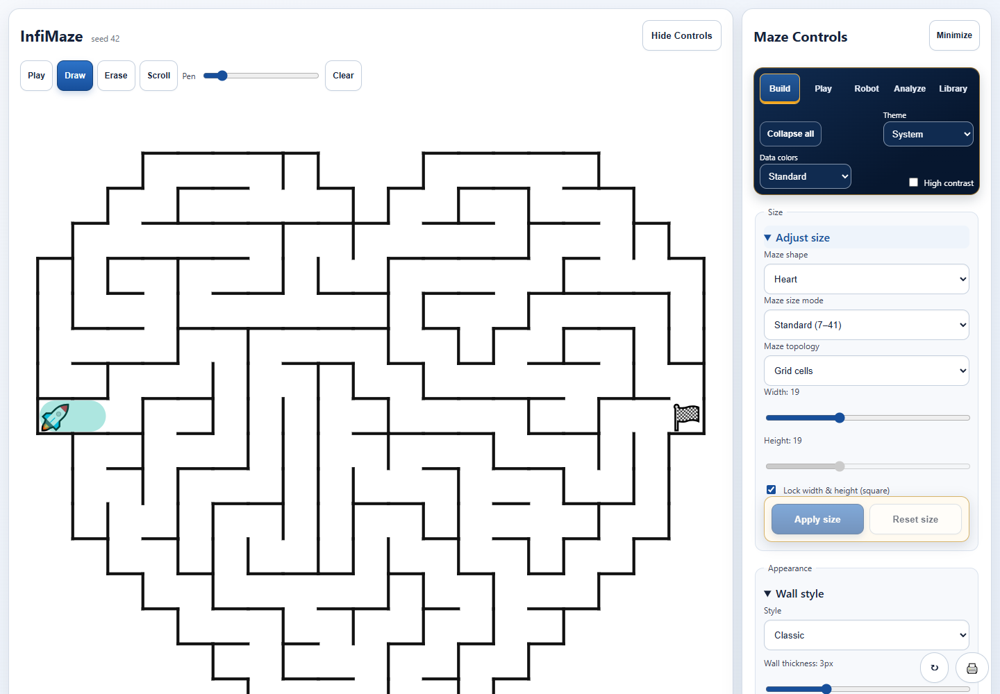

1. Open **Build → Adjust size**.
2. Choose a shape: rectangle, ellipse, diamond, heart, star, cup, brain, moose, or custom silhouette.
3. Choose **Standard** for 7–41 cells or **Giant** for 43–101 cells.
4. Choose **Grid cells** for orthogonal walls or **Freeform regions** for irregular regions.
5. Adjust width and height, then select **Apply size**. Staging avoids regenerating a large maze while a mobile slider is being scrolled.
6. Select **New Maze** for a new seed while retaining the selected controls.

The seed and settings make generation deterministic. The same supported version and settings produce the same maze, which is why challenges, saved mazes, and competition rooms can reproduce a course without uploading it.

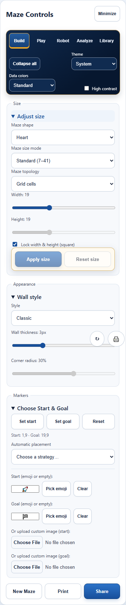

### Generation controls

- **Generation algorithm** changes the maze itself. Randomized DFS favors long corridors; Prim grows a broad frontier; Kruskal joins shuffled regions; Wilson creates an unbiased spanning tree.
- **Goal bias** weights construction toward the goal.
- **Braid** opens extra walls and adds loops. Random mode varies openings; difficulty-aware mode evaluates useful adversarial openings.
- **Turn penalty / straight preference** changes the tendency to continue in the current direction.
- **Max difficulty** runs a bounded worker search and applies the best configuration found for the current seed and size. It is an estimate rather than a guarantee of universal human difficulty.

### Custom silhouettes

Choose **Custom**, upload PNG, JPEG, or WebP artwork, then adjust threshold and inversion until the preview represents the desired solid area. InfiMaze rasterizes that area into active cells. Simple, high-contrast silhouettes with one connected body produce the best mazes.

### Freeform regions

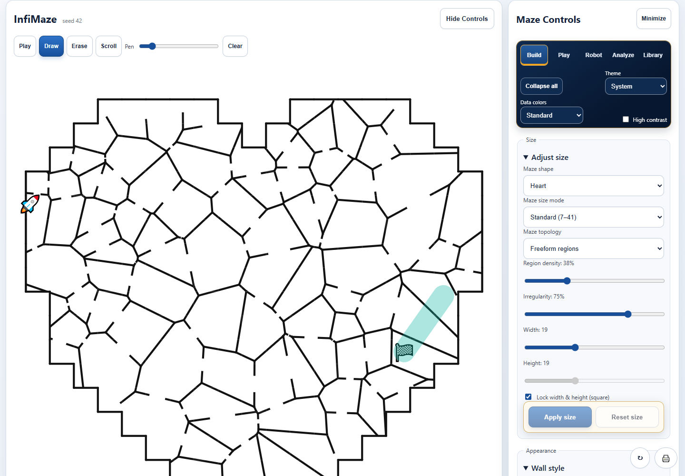

Choose **Freeform regions** to replace square cells with seeded Voronoi regions. **Region density** controls the approximate number of regions and **Irregularity** controls how unevenly they are distributed. Freeform mazes retain masks, algorithms, braiding, endpoint editing, solving, gameplay, saving, sharing, and printing. Micromouse is disabled because its physical model requires square cells and cardinal walls.

## Set endpoints and markers

Open **Build → Choose Start & Goal**.

- Select **Set start** or **Set goal**, then select an active cell in the maze.
- Use automatic placement for opposite edges, a farthest-route approximation, or seeded random endpoints.
- **Reset** restores the generated defaults.
- Enter an emoji or short label, use the emoji picker, clear the marker to show a colored dot, or upload a PNG, JPEG, GIF, or WebP marker up to 5 MB.

Endpoint placement never creates an unreachable goal: the requested cell is mapped to the reachable maze graph, and start and goal remain distinct when the maze has enough cells.

## Choose wall and interface appearance

Under **Build → Wall style**, choose classic, rounded, or organic walls, then set thickness and corner radius. The setting applies to the maze and print output.

The navigation card controls the application interface:

- **Theme:** system, light, or dark.
- **Data colors:** standard or a color-blind-safe palette with distinct patterns.
- **High contrast:** stronger control borders and focus states.

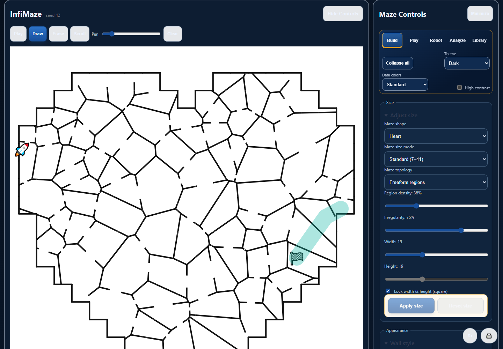

The maze surface remains white in dark mode so drawings, walls, markers, and printed output remain predictable.

## Draw on a maze

Choose **Draw**, set the pen width, and drag with a mouse, pen, or finger. **Erase** removes drawing strokes, **Clear** removes the whole drawing, and **Scroll** reserves touch dragging for page or Giant-maze navigation. Drawings resize with the maze but remain session-only; they are deliberately excluded from saves, shares, rankings, and printing because they are annotations rather than validated routes.

## Animate algorithms

Open **Analyze → Animation Algorithms**.

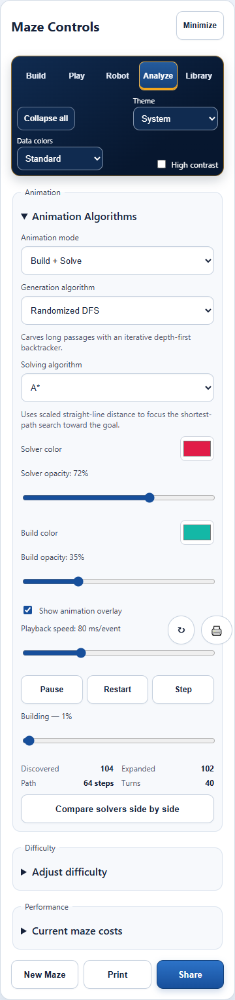

1. Choose **Build + Solve**, **Build only**, or **Solve only**.
2. Choose a generation algorithm independently from DFS, BFS, Dijkstra, or A* solving.
3. Adjust build and solver colors and opacity so their overlays remain distinct.
4. Use Play/Pause, Restart, Step, speed, and the progress slider.
5. Compare discovered nodes, expanded nodes, solution steps, and turns.

The build phase replays the actual generator used to create the maze. The solve phase searches the completed maze. Keeping them independent makes algorithm differences visible without implying that a solver also generates mazes.

### Solver comparison and seed analysis

Enable side-by-side comparison to synchronize two solvers on the same maze and inspect live metric charts. Multi-seed analysis runs aggregate comparisons in a worker so several algorithms can be compared across repeatable mazes without blocking the interface.

## Play a maze

Open **Play → Play maze**, then select **Play** or **Focus game**.

- Move with arrow keys, WASD, highlighted adjacent cells, or swipe.
- Optional breadcrumbs show visited cells.
- **Pause** stops elapsed time.
- **Resume** continues a paused attempt, including after reopening the app.
- **Restart** begins the same maze again.
- **Quit** exits play mode while retaining the paused attempt.
- **Show next move** highlights one shortest-path move and marks the run as assisted, excluding it from competitive rankings.

The timer begins when play begins and accumulates only active play time. Moves count legal transitions; revisits count entries into previously visited cells. Completion records time, moves, revisits, difficulty, and personal-best comparison.

### History and local rankings

Every started maze creates a local history entry. Open an entry to restore its exact maze and paused progress. Completed, unassisted attempts appear in the per-maze leaderboard, sortable by best time or fewest moves. If a Micromouse benchmark exists for that maze, its total time, speed-run time, route, explored percentage, and turns appear alongside human rankings.

## Run Micromouse simulations

Open **Robot → Robot simulation**. Micromouse models a robot that initially knows only its start, goal, dimensions, and walls it has sensed.

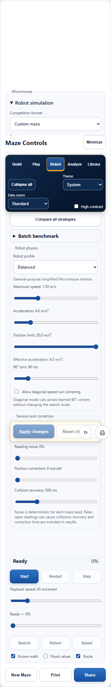

1. Apply full-size 16×16 at 18 cm pitch or half-size 32×32 at 9 cm pitch, or use the current compatible grid.
2. Choose Flood Fill, Trémaux, or Right-Wall exploration.
3. Choose Explorer, Balanced, Sprint, or custom motion settings.
4. Stage sensor range/noise, correction delay, collision penalty, traction, and diagonal speed-run choices.
5. Select **Apply changes**. Robot calculations never run from an accidental slider touch.
6. Select **Start simulation**, then use pause, resume, step, phase, and playback controls.

The animation shows search, return, and learned-map speed-run phases. Simulated time is independent of playback speed. Optional overlays expose sensed walls, flood values, traveled routes, and discovered space.

### Comparisons and exports

**Compare all strategies** evaluates each exploration strategy against the same maze and physics. Batch benchmark mode processes 10, 25, or 50 seeds in a cancellable worker. Download CSV or JSON to analyze completion, timing, exploration, routes, and turns elsewhere. Benchmark share links reproduce the maze and robot configuration without a server.

## Save, organize, print, and back up

Open **Library**.

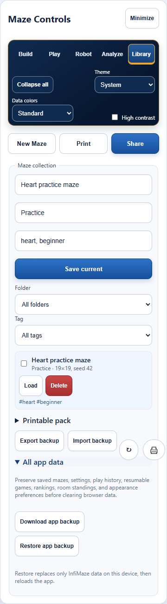

- Name the current maze, optionally assign a folder and comma-separated tags, then select **Save current**.
- Filter by folder or tag, then load or delete an entry.
- Under **Printable pack**, select visible mazes, choose one or two per page, include optional details, and print the pack.
- **Export backup / Import backup** transfers the maze collection only.
- Under **All app data**, **Download app backup** preserves every InfiMaze local-storage record: settings, saved mazes, play history, resumable game, rankings, room standings, and appearance preferences.
- **Restore app backup** validates the file, replaces only InfiMaze-owned data, preserves unrelated origin storage, and reloads the app.

Back up before clearing browser storage, uninstalling the PWA, changing browser profiles, or moving to another device.

## Print and share

**Print** produces a blank maze without controls, algorithm overlays, gameplay hints, or drawing annotations. Browser print settings determine paper size, orientation, and scaling.

**Share** creates a URL containing deterministic maze settings and safe text/emoji markers. Uploaded marker images and drawings remain local. Challenge links open the exact maze directly in gameplay; benchmark links restore the Micromouse configuration.

## Serverless competition rooms

Open **Play → Local rankings → Serverless competition room**.

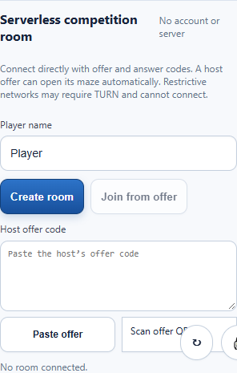

### Connect a participant

1. Enter a player name and room name. The host selects **Create room**, then **Add participant**.
2. The participant scans or pastes the host offer.
3. If needed, **Open host maze** applies the host’s full maze configuration.
4. The participant selects **Join from offer**, which produces an answer.
5. The host scans or pastes that answer and selects **Connect participant**.
6. Both devices show the room name and connected participant names when the encrypted data channel opens.

This two-way exchange is WebRTC signaling performed manually, so no signaling account, database, or paid server is required. A public STUN service helps devices discover routes but does not store the room or carry leaderboard data. Without a TURN relay, restrictive NAT or firewalls can prevent a connection.

Each peer persists a merged local standings copy. The host validates routes and metrics, merges result IDs, and broadcasts the updated snapshot. Devices that were offline catch up only after reconnecting. Export room standings as JSON or CSV for a durable final record.

Connection diagnostics report whether a public STUN route or only a local-network route was found, the browser peer state, and whether the data channel opened. Candidate addresses are never displayed.

## Install, update, and use offline

Install appears when the browser exposes PWA installation. After the service worker finishes caching, the app shell, maze features, emoji picker, and calculation workers operate offline. An offline indicator remains visible until connectivity returns. When an update is ready, select **Update**; save or finish session-only drawings first because reload clears them.

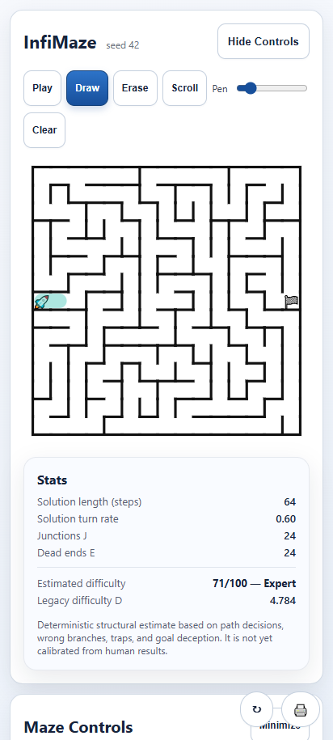

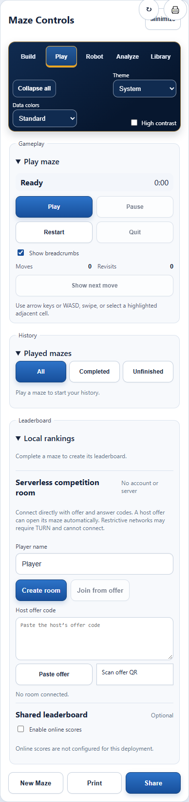

## Data and privacy

InfiMaze defaults to local browser storage. Shared URLs contain reproducible settings. Serverless rooms transmit maze definitions, validated replays, player names, and results directly between connected peers. The optional hosted leaderboard client remains disabled unless a deployment supplies an endpoint and the user explicitly enables it.

Clearing browser or PWA data deletes local records. Use **Library → All app data → Download app backup** first.

